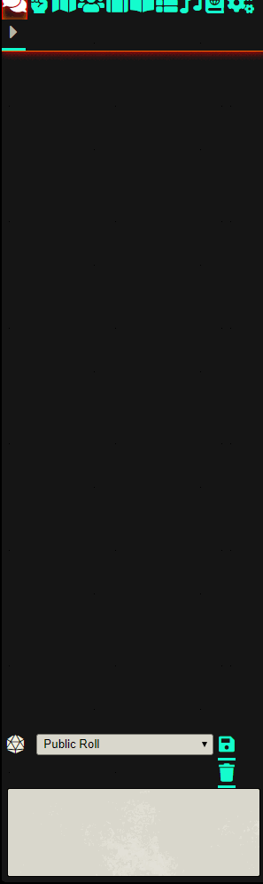

# Zork System

A Foundry wrapper of the Public Domain Zork 1 (https://github.com/devshane/zork). Powered by the Andy Hattemer's API: https://andyhattemer.com/zork-web-api-with-spaces.html.

This was done as a joke, but it's fully playable. Save state is cookie based.

